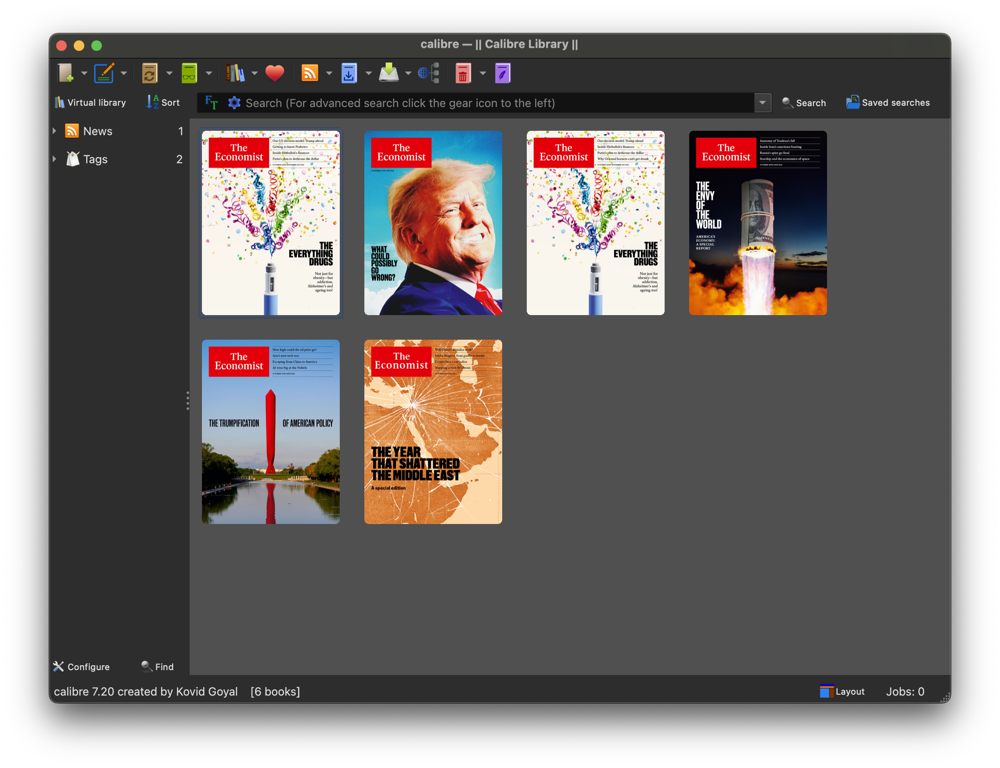
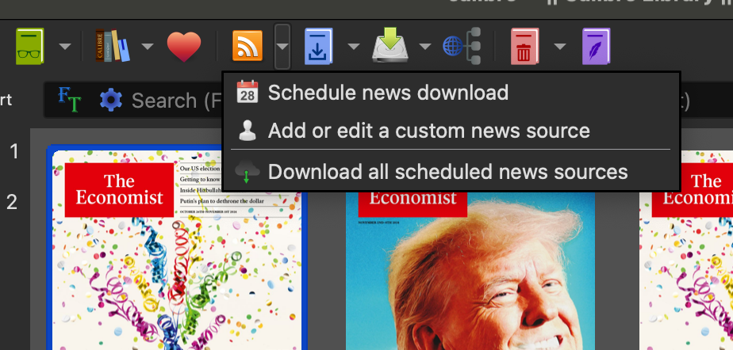
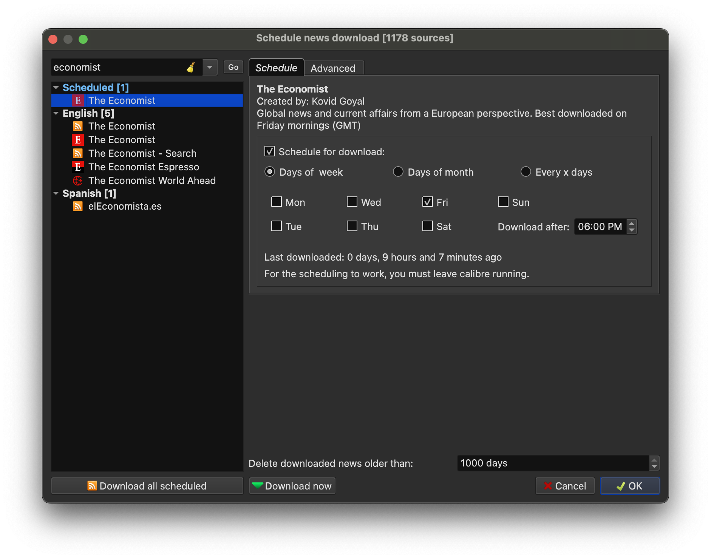
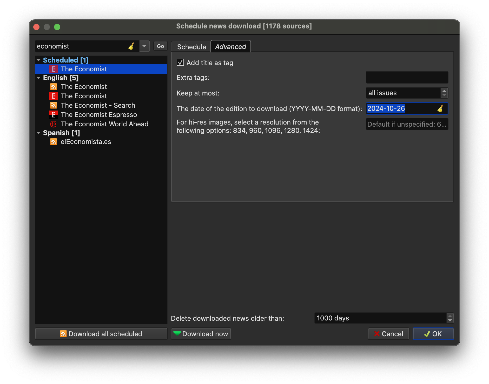

# How to download **The Economist** Magzine every week via [Calibre](https://calibre-ebook.com/download)

## 1. Download Calibre

https://calibre-ebook.com/download

## 2. "Fetch News"

Click **Fetch News** icon in the toolbar:

Search for keywork "economist":

Click "Download Now" at the button, the latest issue will be downloaded in a few minutes.

## 3. Download a specified issue

Specify the release date of the issue, for instance `2024-10-26`. You can find the release date at the cover page.
